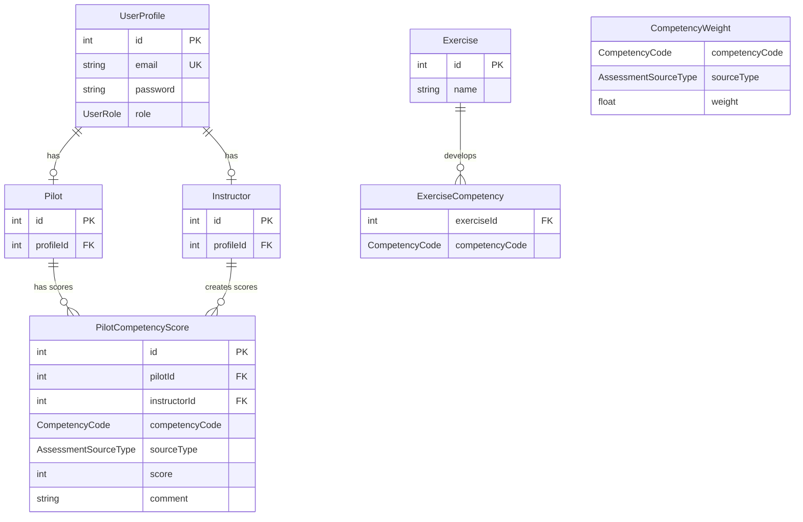
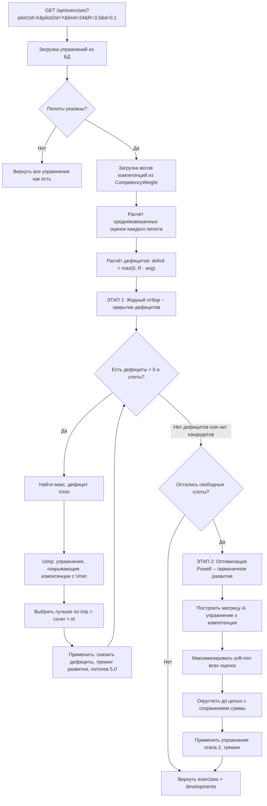
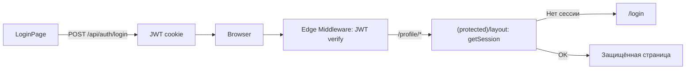

# Pilots Training Portal -- архитектура и логика

## Что это за приложение

Портал для тренировки пилотов. Позволяет:
- **Инструкторам** -- выставлять оценки пилотам по 8 компетенциям из 4 разных источников
- **Пилотам** -- просматривать свой профиль, оценки, и получать персонализированную программу тренировок
- **Системе** -- автоматически генерировать оптимальный набор упражнений для экипажа (1-2 пилота), закрывая дефициты компетенций

---

## Общая архитектура

```mermaid
graph TB
    subgraph frontend [Frontend -- Next.js App Router]
        Login[/login]
        Register[/register]
        Profile[/profile]
        Assessments[/assessments]
        Sessions[/sessions]
        Weights[/competency-weights]
    end

    subgraph api [API Routes]
        AuthAPI["/api/auth/*"]
        PilotsAPI["/api/pilots"]
        AssessmentsAPI["/api/assessments"]
        AvgAPI["/api/average-assessments"]
        ExercisesAPI["/api/exercises"]
        WeightsAPI["/api/competency-weights"]
        ProfileAPI["/api/profile/update"]
    end

    subgraph db [PostgreSQL]
        UserProfile
        Pilot
        Instructor
        PilotCompetencyScore
        Exercise
        ExerciseCompetency
        CompetencyWeight
    end

    subgraph auth [Auth Layer]
        Middleware["middleware.ts -- JWT verify"]
        ProtectedLayout["(protected)/layout.tsx -- getSession"]
    end

    frontend --> auth
    auth --> api
    api --> db

    ExercisesAPI -->|"Ключевая ручка"| Optimizer["optimization-js Powell"]
```

---

## Доменная модель



**8 компетенций пилота** (enum `CompetencyCode`):
- PRO -- Следование процедурам
- COM -- Взаимодействие
- FPA -- Пилотирование (автоматика)
- FPM -- Пилотирование (ручное)
- LTW -- Лидерство и командная работа
- PSD -- Решение проблем
- SAW -- Ситуационная осознанность
- WLM -- Управление нагрузкой

**4 источника оценок** (enum `AssessmentSourceType`):
- PC -- Квалификационная проверка (Proficiency Check)
- FDM -- Анализ полётных данных (Flight Data Monitoring)
- EVAL -- Этап оценки (Evaluation Phase)
- ASR -- Авиационное событие (Aviation Safety Report)

---

## Ключевая ручка: `GET /api/exercises`

Это ядро приложения -- алгоритм генерации персонализированной тренировочной программы.

### Входные параметры (query string)

- `pilot1Id`, `pilot2Id` -- ID пилотов (один или оба)
- `limit` -- количество слотов в программе (по умолчанию 24)
- `R` -- целевой балл (по умолчанию 3.5)
- `d` -- приращение за одно упражнение (по умолчанию 0.1)

### Алгоритм -- два этапа



### Этап 1 подробно -- жадный алгоритм

Цель: **устранить дефициты** (оценки ниже целевого `R`).

1. Считаем средневзвешенный балл пилота по каждой компетенции. Веса зависят от источника оценки и хранятся в таблице `CompetencyWeight`. Формула:

   `avg(code) = sum(score_i * weight_i) / sum(weight_i)`  для всех источников с оценками

2. Дефицит для пары `(pilot, competency)`:

   `deficit = max(0, R - avg)`

3. Итеративно выбираем лучшее неиспользованное упражнение:
   - Находим `Vmin` -- максимальный дефицит среди всех пар
   - `Uimp` -- пул упражнений, покрывающих компетенции с макс. дефицитом И другие дефицитные компетенции
   - Ранжирование: `imp` (ожидаемый прирост) > `cover` (покрытие дефицитных компетенций) > `id` (стабильная сортировка)
   - Применяем упражнение: уменьшаем дефицит на `min(deficit, d)`, обновляем текущий балл, потолок 5.0

4. Останавливаемся когда: дефициты = 0, нет кандидатов с imp > 0, или заполнены все слоты

### Этап 2 подробно -- оптимизация Powell

Цель: **гармоничное развитие** -- заполнить оставшиеся слоты так, чтобы поднять самые слабые компетенции.

1. Строится матрица `A[K][M]`: K = кол-во пар (pilot, competency), M = оставшиеся упражнения
2. `s0` -- текущие оценки после Этапа 1
3. Целевая функция: максимизация `softMin` всех оценок (мин. оценка должна быть как можно выше)
4. Метод Powell из `optimization-js` решает непрерывную задачу
5. Результат округляется до целых чисел с сохранением суммы через банковское округление

### Выход

```json
{
  "exercises": [
    { "id": 1, "name": "...", "competencies": ["PRO", "COM"], "step": "first" },
    { "id": 5, "name": "...", "competencies": ["FPA"], "step": "second" }
  ],
  "developments": {
    "42": { "PRO": 0.5, "COM": 0.3, "FPA": 0.1 },
    "43": { "PRO": 0.2, "SAW": 0.4 }
  }
}
```

- `step: "first"` -- упражнения Этапа 1 (закрытие дефицитов)
- `step: "second"` -- упражнения Этапа 2 (гармонизация)
- `developments` -- ожидаемый прирост по компетенциям для каждого пилота

---

## Аутентификация и защита



- JWT в httpOnly cookie (`token`)
- `middleware.ts` -- edge-проверка для `/profile/*`, `/instructor/*`
- `(protected)/layout.tsx` -- серверная проверка сессии для `/assessments`, `/sessions`, `/competency-weights`

---

## Резюме

Портал решает задачу **Evidence-Based Training (EBT)** для авиации: на основе оценок пилота из 4 источников система автоматически генерирует оптимальную тренировочную программу из двух этапов -- сначала жадно закрывает критические дефициты, затем оптимизацией Powell обеспечивает гармоничное развитие всех компетенций.
